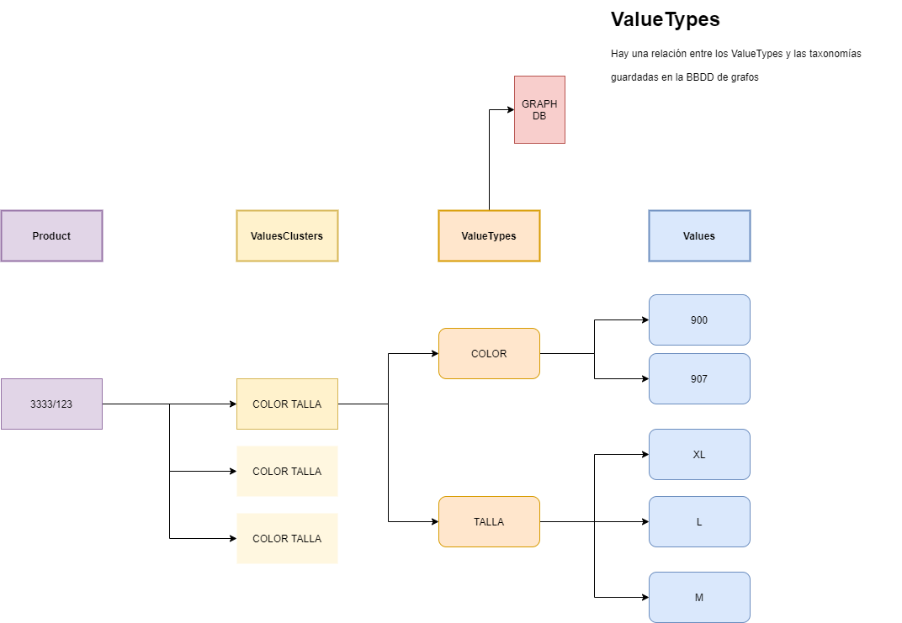

# Variants test
Instalar
```
npm install
```

Arrancar
```
node main.js
```

## Rest client collections
* [Insomnia](./doc/insomnia/Insomnia_2023-08-01.json)
* [Postman](./doc/postman_collection/Variants.postman_collection.json)

## Diagrama
